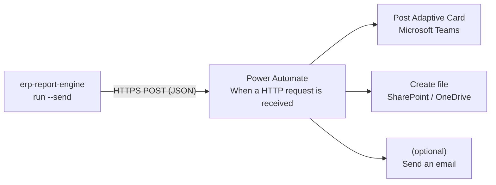

# Power Automate — deliver & archive the weekly report

The engine can **deliver itself**. `run --send` already posts a summary to Teams
and e-mails the HTML report; this folder turns that into a full, hands-off
pipeline in **Power Automate**: on every run the flow posts an Adaptive Card to a
Teams channel *and* files the HTML report into SharePoint (or OneDrive), so the
weekly report shows up where the team already works — no one opens a tool.



Every secret — the flow URL, SMTP password, other webhooks — is read from an
**environment variable**, never the config file. A channel that fails is logged
and never aborts the run; the report is already written to disk.

There are two ways to wire this up. **Path A** is two minutes and posts a card.
**Path B** is the full flow that also archives the report.

---

## Path A — 2-minute card-to-Teams (no custom flow)

This uses the built-in Teams *Workflows* template — the official replacement for
the Office 365 connectors that were retired in 2026 — and the engine's existing
`teams` channel.

1. In **Teams**, open the channel → **⋯ → Workflows** (or the **Power Automate**
   app) → search the template **"Post to a channel when a webhook request is
   received"** and add it. Pick the team and channel.
2. Copy the **HTTP POST URL** it generates.
3. Put the URL in an environment variable and point the config at it:

   ```yaml
   # config.yaml
   delivery:
     teams:
       webhook_url_env: ERP_TEAMS_WEBHOOK
   ```
   ```bash
   export ERP_TEAMS_WEBHOOK='https://prod-XX.westeurope.logic.azure.com/workflows/…/invoke?...'
   erp-report-engine run -c config.yaml --send
   ```

The engine posts an Adaptive Card (title + the week's findings). Done — that's
the `teams` channel; the flow requires zero editing.

---

## Path B — full flow: card **and** archive the report

Use this when you also want the HTML report filed automatically. It adds one new
delivery channel, `power_automate`, which sends a richer JSON payload: the
ready-to-post card, the plain findings, and the **HTML report as base64** so the
flow can save it.

### 1. Create the flow

Power Automate → **Create → Instant cloud flow → When a HTTP request is
received**.

- In the trigger, **"Use sample payload to generate schema"** — or paste
  [`request-schema.json`](request-schema.json) into **Request Body JSON Schema**.
  It describes exactly what the engine sends:

  ```json
  {
    "source": "erp-report-engine",
    "week": "2026-W28",
    "title": "Weekly ERP report — 2026-W28",
    "findings": ["Revenue +7.2% WoW", "On-time 93.5%", "5 items below cover"],
    "card": { "type": "AdaptiveCard", "…": "… ready to post …" },
    "report": {
      "filename": "report_2026-W28.html",
      "contentType": "text/html",
      "contentBytesBase64": "PGh0bWw+…"
    }
  }
  ```

### 2. Post the Adaptive Card to Teams

Add **Microsoft Teams → Post card in a chat or channel**. Choose the team and
channel, then in **Adaptive Card** switch to the expression editor and use the
card the engine already built:

```
triggerBody()?['card']
```

(No card design needed — the engine renders it. See Microsoft's
[Adaptive Cards in Power Automate](https://learn.microsoft.com/power-automate/create-adaptive-cards).)

### 3. Archive the report to SharePoint / OneDrive

Add **SharePoint → Create file** (or **OneDrive for Business → Create file**):

| Field | Value (expression) |
|-------|--------------------|
| Site Address | your SharePoint site |
| Folder Path | `/Shared Documents/ERP Reports` |
| File Name | `triggerBody()?['report']?['filename']` |
| File Content | `base64ToBinary(triggerBody()?['report']?['contentBytesBase64'])` |

`base64ToBinary(...)` is required — **Create file** needs *binary*, and the
report rides in as base64 ([why](https://d365demystified.com/2022/01/12/create-file-correctly-in-sharepoint-from-dataverse-connector-using-power-automate-using-base64tobinary-expression/)).

*(Optional)* add **Office 365 Outlook → Send an email (V2)** and attach the same
decoded content, or drop the findings into the body.

### 4. Point the engine at the flow

Save the flow, copy the trigger's **HTTP POST URL**, and enable the channel:

```yaml
# config.yaml
delivery:
  power_automate:
    webhook_url_env: ERP_POWER_AUTOMATE_URL
    include_report: true      # set false to post the card only (no archive)
```
```bash
export ERP_POWER_AUTOMATE_URL='https://prod-XX.westeurope.logic.azure.com/workflows/…/invoke?...'
erp-report-engine run -c config.yaml --send
```

[`erp-report-flow.definition.json`](erp-report-flow.definition.json) is the same
flow as a definition file — the exact actions and expressions, to reproduce in
the designer or adapt into an Azure Logic App. Replace every `<PLACEHOLDER>`.

---

## Automate the weekly run

The flow reacts to a POST; something still has to *run the engine* weekly. Any
scheduler works — the report is a CLI command:

- **Windows Task Scheduler** — weekly trigger →
  `erp-report-engine run -c config.yaml --send`
- **cron** (Linux/macOS) — `0 7 * * 1  erp-report-engine run -c config.yaml --send`
- **GitHub Actions** — a `schedule:` workflow with the secrets as `env:`

Pair it with the `healthcheck` channel so a run that silently stops paging you is
itself detectable.

## Security

- The flow URL is a **capability secret** — anyone with it can invoke the flow.
  Keep it in an environment variable / secret store, never in the repo or config.
- The payload carries business figures and the full report. Send it only to a
  flow in your own tenant; keep the SharePoint target access-controlled.
- Grant the flow's connections least privilege (one channel, one library).
- Rotate the URL if it leaks (regenerate the trigger).

## Test it without a full run

The payload builder is a pure function, so you can eyeball it:

```bash
python -c "from erp_report_engine.delivery import automation_payload; import json; \
print(json.dumps(automation_payload('2026-W28', ['Revenue +7.2% WoW'], '<h1>hi</h1>'), indent=2)[:600])"
```

Then send a sample to the flow URL to confirm it posts and archives:

```bash
curl -X POST "$ERP_POWER_AUTOMATE_URL" -H 'Content-Type: application/json' \
  -d '{"source":"erp-report-engine","week":"2026-W28","title":"Test",
       "findings":["hello"],"card":{"type":"AdaptiveCard",
       "$schema":"http://adaptivecards.io/schemas/adaptive-card.json","version":"1.4",
       "body":[{"type":"TextBlock","text":"Test card","weight":"Bolder"}]},
       "report":{"filename":"report_test.html","contentType":"text/html",
       "contentBytesBase64":"PGgxPmhpPC9oMT4="}}'
```
