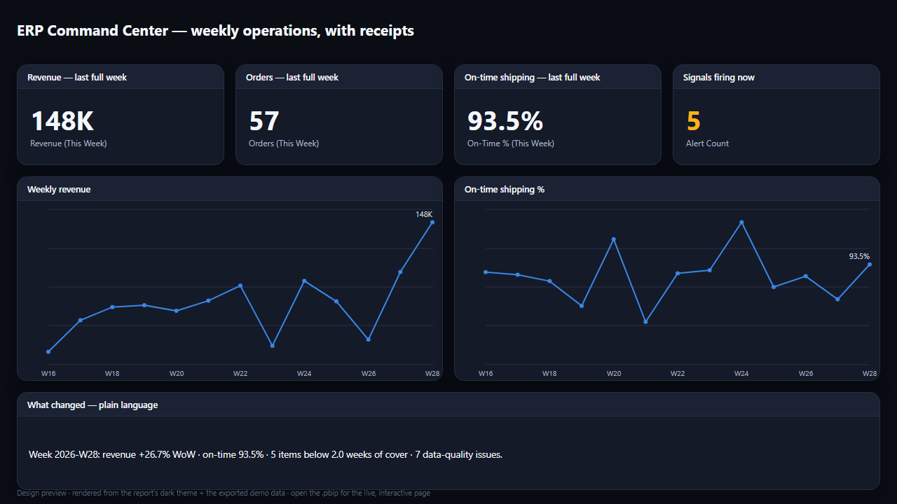
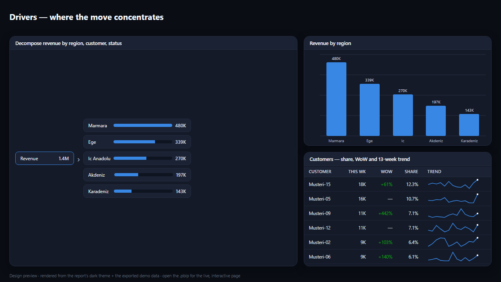
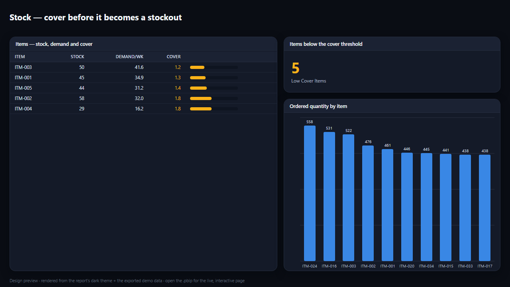
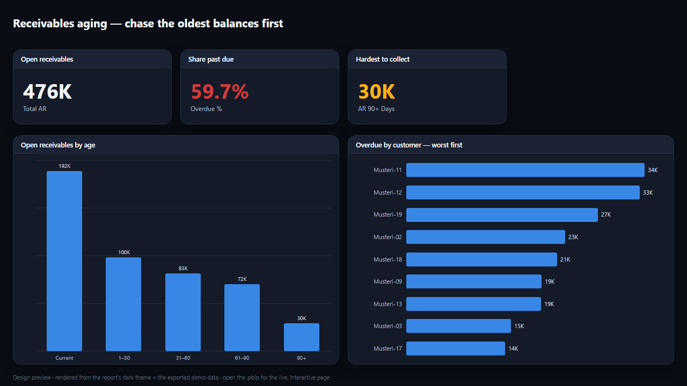
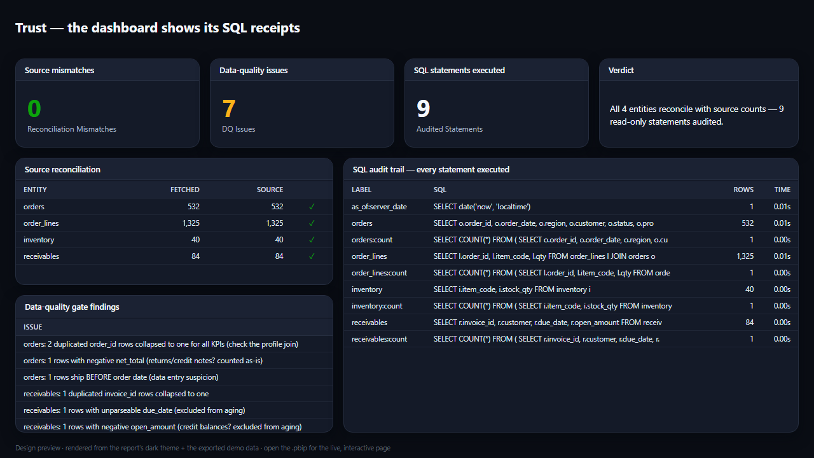

# Report page previews

These PNGs are **design previews** of the five Power BI report pages — rendered
from the report's own dark theme (`../ERP Command Center.Report/StaticResources/RegisteredResources/measurement-honesty-theme.json`)
and the committed demo data (`../data/`), at the generator's exact visual
coordinates (1280×720).

They are **not** Power BI Desktop screenshots — they're a faithful preview of
what each page shows. For the live, interactive report, open
[`../ERP Command Center.pbip`](../ERP%20Command%20Center.pbip) in Power BI Desktop.

| Page | Preview |
|------|---------|
| **Overview** — headline KPIs + trends + verdict |  |
| **Drivers** — revenue decomposition, region, per-customer sparklines |  |
| **Stock** — cover bars + ordered quantity |  |
| **Aging** — receivables aging by bucket + overdue by customer |  |
| **Trust** — reconciliation, data-quality gate, full SQL audit trail |  |

Single-measure charts are one colour (blue), exactly as Power BI renders them.
Every figure is the demo dataset's real value, computed the same way the report
computes it — one definition, every surface.
